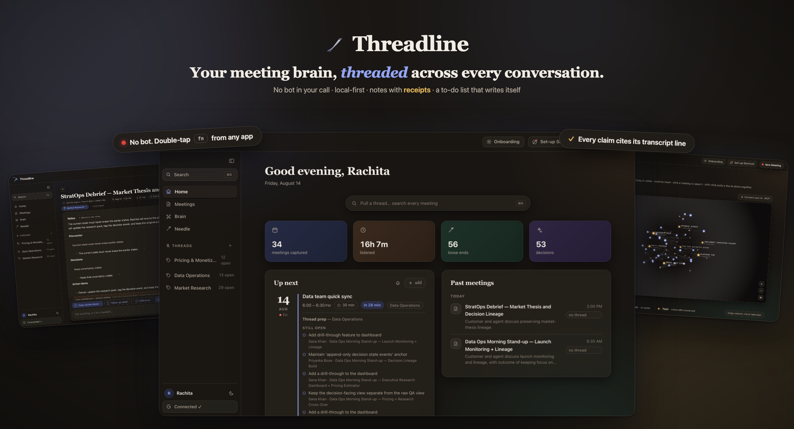
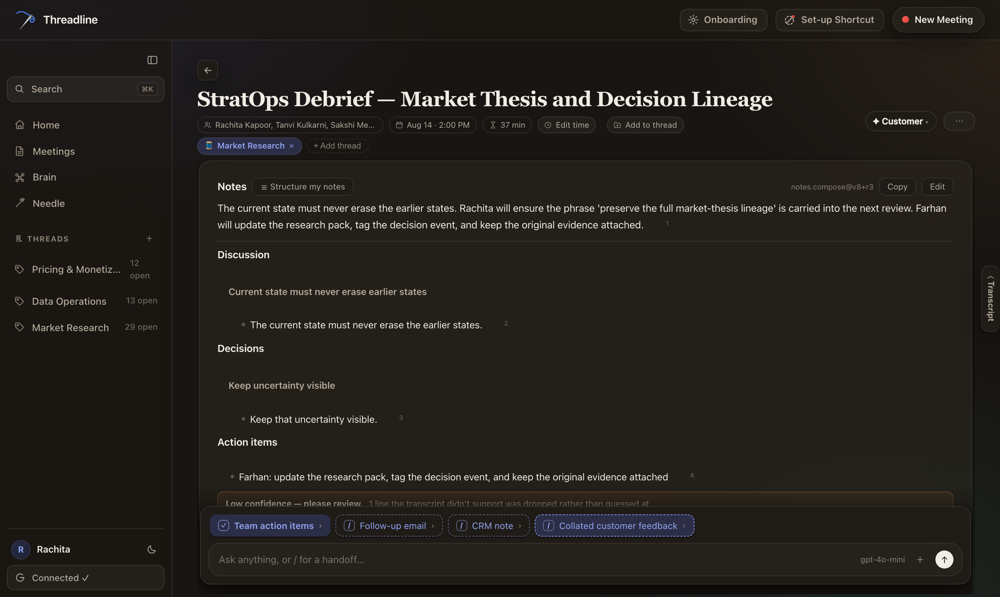
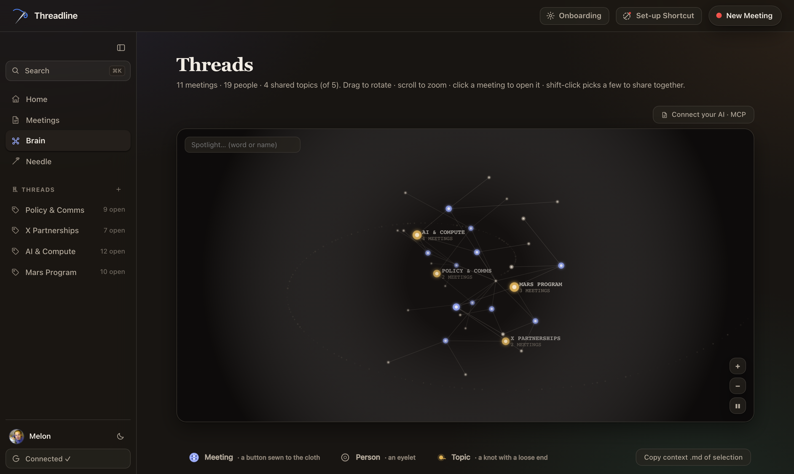
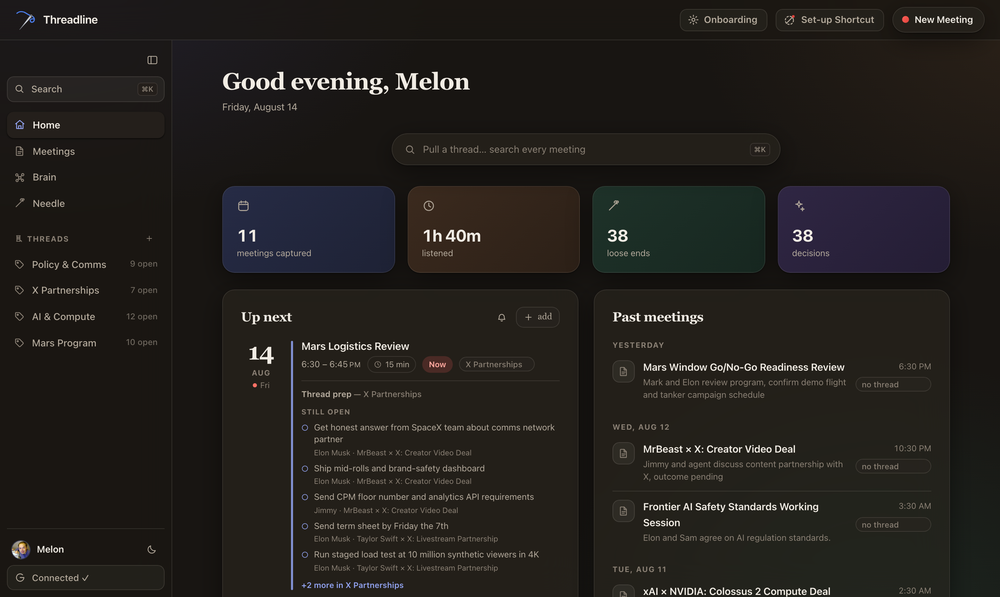

# Threadline



**Granola takes notes about your meeting. Threadline takes your side in it.**

Local-first meeting brain. No bot in your call — audio is captured on your
laptop, both sides, from any app, with a double-tap of `fn`. Every meeting
becomes notes with receipts, a to-do list that writes itself, and a node in a
3D atlas of everything you've ever discussed.

## Why it's different

- **No bot joins the call** — capture is native (system audio + mic), so your
  customer never sees "Threadline Notetaker has joined". Works with Zoom,
  Meet, Teams, phone calls through your speakers, or a room full of people.
- **Notes with receipts** — every decision, risk and action item points at the
  exact transcript line it came from. A claim with no proof never ships: a
  grounding gate blocks it, the run is recorded with the reason, and the
  meeting honestly says *partial* instead of bluffing.
- **A to-do list that writes itself** — loose ends with owners pulled from
  what people actually committed to, threaded across meetings, stitched closed
  with a needle when you tick them.
- **Threads** — tag meetings to a thread (Mars Program, Pricing v3, …) and
  every upcoming meeting preps itself: what's still open vs done across that
  thread's whole history.
- **Live assist, in the call** — the floating companion shows the transcript
  as it streams and carries an Ask box: pick the thread and mid-call questions
  are answered from that thread's entire repo — past meetings, decisions,
  docs — with sources named. Your meeting history has your back while you're
  still talking.
- **The Brain** — a rotating atlas of meetings, people and topics. Spotlight a
  word to collapse the graph to what mentions it; export any node as a
  grounded context `.md` for whatever LLM you use.
- **Local-first, actually** — audio goes to exactly one place: the speech API
  you configured. Transcripts, notes, graph and search live in a SQLite file
  on your machine. Teams that ban cloud notetakers can run this.





Prefer daylight? There's a warm light theme too — the toggle lives next to
your name.



## Quick start (five minutes, honestly)

```bash
git clone https://github.com/rachitamahajan-design/threadline && cd threadline
npm install
npm run dev                 # → http://localhost:4640
```

The **onboarding wizard** opens itself on a fresh install: it mints a free
PyAI sandbox key (or takes one you paste), builds the native capture helper,
walks through the two macOS permissions, connects your calendar (paste one
iCal link — no OAuth setup), and can seed sample meetings so every view has
something to show. Keys land in `.env` and apply immediately.

Prefer the terminal? `cp .env.example .env`, add `PYAI_API_KEY`, then
`npm run demo` processes the sample meetings end to end — extraction, gates,
receipts, graph — exactly like recorded audio.

## Record from anywhere

Double-tap `fn` (or bind a macOS Shortcut to `scripts/record-toggle.sh`) from
any app: a native floating panel appears with the timer and a Stop button, and
the browser companion pops out with the live transcript, a mode picker, a
thread picker, and an Ask box that answers from that thread's history while
you're still on the call. Meetings you never name title themselves from their
own content; takes under 15 seconds are discarded as accidental taps.

Multi-party calls get **speaker identification** after each take: the saved
tape is diarized (PyAI batch job) and split into Speaker 1/2/3 — the far side
on calls, the mic channel for in-person rooms, both for hybrid. Name each
voice once and it propagates through transcript, entities, graph and search;
the notes rebuild themselves against the diarized transcript.

Capture needs **Screen Recording + Microphone** permission for the app that
owns `npm run dev`; the global hotkey needs **Accessibility**.

## Give your Claude this brain (MCP)

Threadline ships a local [MCP](https://modelcontextprotocol.io) server, so any
MCP client — Claude Code, Claude Desktop, Cursor — can pull your meeting
context live: search across every meeting, list open action items, read a
topic's full history, with receipts on every result. Runs over stdio on your
machine, needs **no API keys**, and never exposes bulk transcripts: evidence
only (quotes + timestamps).

**Claude Code:**

```bash
claude mcp add threadline -- npx tsx "/path/to/threadline/src/mcp/server.ts"
```

**Claude Desktop** — add to `claude_desktop_config.json`:

```json
{ "mcpServers": { "threadline": {
    "command": "npx",
    "args": ["tsx", "/path/to/threadline/src/mcp/server.ts"] } } }
```

Tools: `brain_info` (start here) · `search_brain` · `list_claims` ·
`get_entity` · `get_meeting` · `list_meetings` · `get_evidence` ·
`refresh_brain_md`. There is also `data/BRAIN.md` — a regenerated ~300-token
index of everything the brain knows (`npm run brain-md`), the cheapest way for
any agent to prime itself before querying.

## Growth loops

Every artifact Threadline produces is built to travel — and to bring the next
user back with it:

1. **Copy carries attribution** — copy notes or an outline anywhere (Slack,
   email, a doc) and it lands formatted with a quiet *Powered by Threadline 🪡*
   link at the bottom. Every paste is a referral.
2. **Screenshotability** — the app is designed to be photographed: the Brain
   atlas, the gradient stat cards, the needle stitching a loose end closed.
   Needle conversations export as branded share cards — PNG for Slack, or a
   PDF whose GitHub link actually clicks and whose clone command is
   selectable text. Brain spotlights export as looping GIFs with a grounded
   summary.
3. **The interactive Brain, as a file** — export any selection of the atlas
   as a self-contained interactive HTML page: it rotates, it's explorable,
   it works offline, and it links back to the repo. Send your brain to
   someone who doesn't have the app yet.
4. **Needle sharing** — every answer card names its receipts ("5 receipts
   across 3 meetings"), so the thing that spreads is also the proof that it
   works.


## The harness — AI work without trusting the model

Every model-backed workflow (extraction, notes, handoffs, diarization, ask)
runs **closed loop**, wired per [harnesses.md](harnesses.md):

- **Budget governor** — per-workflow unit budgets from `agents.json`; when the
  budget is spent, the run exits *deadline*, it doesn't keep burning.
- **Deterministic gates** — grounding (every claim must cite a transcript
  line) plus a configurable entailment gate. Output that fails a gate is
  blocked and pruned, not shipped.
- **Silent, aimed retries** — a failed step retries with the failure fed back
  into the prompt, capped, without the user ever seeing the churn.
- **Four named exits** — every run ends `shipped | partial | deadline |
  failed`, and *partial* is displayed honestly in the UI instead of bluffing.
- **Crash-proof records** — run rows are written at start and finalized at
  exit, so even a killed process leaves an auditable trail (`runs` table +
  rotated JSONL logs that never contain meeting content).
- **Config, not code** — models, providers (with silent failover), budgets,
  retry caps, gate strictness and prompts all live in `agents.json` /
  `config/prompts.json`.

Speech runs on [PyAI](https://pyai.com) — live streaming transcription,
batch diarization, Recap extraction. One key; `npm run demo` mints a free
sandbox key itself. If PyAI is unreachable, the locally saved tape falls back
to a second provider automatically — an outage degrades the product instead
of killing it.

## License

[MIT](LICENSE)
